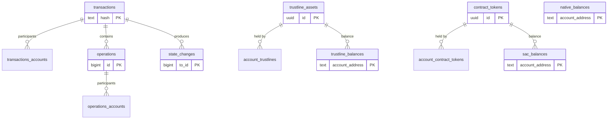

# Freighter Data Models

> **Skill**: Load this when you need to understand what data exists, where it lives, and how it's shaped — across PostgreSQL, GraphQL, Go structs, and TypeScript types.
>
> **When to use**: Designing new features that touch data, writing migrations, adding API fields, understanding balance/token/transaction data flow.

---

## Wallet Backend — PostgreSQL Schema

The wallet-backend owns all persistent blockchain data. 14 tables across 3 domains.

### Domain 1: Ledger Indexing (transactions, operations, state changes)

```sql
-- Core transaction record. Primary unit of ledger data.
CREATE TABLE transactions (
    hash              TEXT PRIMARY KEY,
    to_id             BIGINT NOT NULL,
    envelope_xdr      TEXT,
    fee_charged       BIGINT NOT NULL,
    result_code       TEXT NOT NULL,
    meta_xdr          TEXT,
    ledger_number     INTEGER NOT NULL,
    ledger_created_at TIMESTAMPTZ NOT NULL,
    is_fee_bump       BOOLEAN NOT NULL DEFAULT false,
    ingested_at       TIMESTAMPTZ NOT NULL DEFAULT NOW()
);
-- INDEX: idx_transactions_ledger_created_at

-- Junction: which accounts participated in which transactions
CREATE TABLE transactions_accounts (
    tx_hash    TEXT NOT NULL REFERENCES transactions(hash) ON DELETE CASCADE,
    account_id TEXT NOT NULL,
    created_at TIMESTAMPTZ NOT NULL DEFAULT NOW(),
    PRIMARY KEY (account_id, tx_hash)
);

-- Individual operations within transactions
CREATE TABLE operations (
    id                BIGINT PRIMARY KEY,
    tx_hash           TEXT NOT NULL REFERENCES transactions(hash),
    operation_type    TEXT NOT NULL,
    operation_xdr     TEXT,
    result_code       TEXT NOT NULL,
    successful        BOOLEAN NOT NULL,
    ledger_number     INTEGER NOT NULL,
    ledger_created_at TIMESTAMPTZ NOT NULL,
    ingested_at       TIMESTAMPTZ NOT NULL DEFAULT NOW()
);
-- INDEXES: idx_operations_tx_hash, idx_operations_operation_type, idx_operations_ledger_created_at

-- Junction: which accounts participated in which operations
CREATE TABLE operations_accounts (
    operation_id BIGINT NOT NULL REFERENCES operations(id) ON DELETE CASCADE,
    account_id   TEXT NOT NULL,
    created_at   TIMESTAMPTZ NOT NULL DEFAULT NOW(),
    PRIMARY KEY (account_id, operation_id)
);

-- Granular state changes produced by operations (balances, flags, signers, etc.)
CREATE TABLE state_changes (
    to_id                BIGINT NOT NULL,
    state_change_order   BIGINT NOT NULL,
    state_change_category TEXT NOT NULL,  -- BALANCE, ACCOUNT, SIGNER, FLAGS, TRUSTLINE, etc.
    state_change_reason  TEXT,            -- CREATE, DEBIT, CREDIT, MINT, BURN, etc.
    ingested_at          TIMESTAMPTZ NOT NULL DEFAULT NOW(),
    ledger_created_at    TIMESTAMPTZ NOT NULL,
    ledger_number        INTEGER NOT NULL,
    account_id           TEXT NOT NULL,
    operation_id         BIGINT NOT NULL,
    tx_hash              TEXT NOT NULL REFERENCES transactions(hash),
    token_id             TEXT,
    amount               TEXT,
    flags                JSONB,
    key_value            JSONB,
    offer_id             TEXT,
    signer_account_id    TEXT,
    signer_weights       JSONB,
    spender_account_id   TEXT,
    sponsored_account_id TEXT,
    sponsor_account_id   TEXT,
    deployer_account_id  TEXT,
    funder_account_id    TEXT,
    thresholds           JSONB,
    trustline_limit      JSONB,
    PRIMARY KEY (to_id, state_change_order)
);
-- INDEXES: account_id, tx_hash, operation_id, ledger_created_at
```

### Domain 2: Token Registry (contract tokens, trustline assets)

```sql
-- Soroban contract tokens (SAC + SEP-41). UUID derived from contract_id.
CREATE TABLE contract_tokens (
    id          UUID PRIMARY KEY,
    contract_id TEXT UNIQUE NOT NULL,
    type        TEXT NOT NULL,          -- 'SAC' or 'SEP41'
    code        TEXT NULL,              -- SAC: asset code
    issuer      TEXT NULL,              -- SAC: asset issuer
    name        TEXT NULL,              -- SEP-41: token name
    symbol      TEXT NULL,              -- SEP-41: token symbol
    decimals    SMALLINT NOT NULL,
    created_at  TIMESTAMPTZ NOT NULL DEFAULT NOW(),
    updated_at  TIMESTAMPTZ NOT NULL DEFAULT NOW()
);

-- Classic Stellar trustline assets. UUID v5 from 'CODE:ISSUER'.
CREATE TABLE trustline_assets (
    id      UUID PRIMARY KEY,
    code    TEXT NOT NULL,
    issuer  TEXT NOT NULL,
    created_at TIMESTAMPTZ NOT NULL DEFAULT NOW(),
    UNIQUE(code, issuer)
);
```

### Domain 3: Account Balances (native, trustlines, SAC, contract tokens)

```sql
-- Native XLM balances
CREATE TABLE native_balances (
    account_address      TEXT PRIMARY KEY,
    balance              BIGINT NOT NULL DEFAULT 0,
    minimum_balance      BIGINT NOT NULL DEFAULT 0,
    buying_liabilities   BIGINT NOT NULL DEFAULT 0,
    selling_liabilities  BIGINT NOT NULL DEFAULT 0,
    last_modified_ledger BIGINT NOT NULL DEFAULT 0
);

-- Classic trustline balances (G... accounts holding issued assets)
CREATE TABLE trustline_balances (
    account_address      TEXT NOT NULL,
    asset_id             UUID NOT NULL REFERENCES trustline_assets(id),
    balance              BIGINT NOT NULL DEFAULT 0,
    trust_limit          BIGINT NOT NULL DEFAULT 0,
    buying_liabilities   BIGINT NOT NULL DEFAULT 0,
    selling_liabilities  BIGINT NOT NULL DEFAULT 0,
    flags                INTEGER NOT NULL DEFAULT 0,
    last_modified_ledger BIGINT NOT NULL DEFAULT 0,
    PRIMARY KEY (account_address, asset_id)
);

-- SAC balances for contract addresses (C... accounts only)
CREATE TABLE sac_balances (
    account_address      TEXT NOT NULL,
    contract_id          UUID NOT NULL REFERENCES contract_tokens(id),
    balance              TEXT NOT NULL DEFAULT '0',
    is_authorized        BOOLEAN NOT NULL DEFAULT true,
    is_clawback_enabled  BOOLEAN NOT NULL DEFAULT false,
    last_modified_ledger INTEGER NOT NULL DEFAULT 0,
    PRIMARY KEY (account_address, contract_id)
);

-- Junction: account ↔ trustline asset mapping
CREATE TABLE account_trustlines (
    account_address TEXT NOT NULL,
    asset_id        UUID NOT NULL REFERENCES trustline_assets(id),
    PRIMARY KEY (account_address, asset_id)
);

-- Junction: account ↔ contract token mapping
CREATE TABLE account_contract_tokens (
    account_address TEXT NOT NULL,
    contract_id     UUID NOT NULL REFERENCES contract_tokens(id),
    PRIMARY KEY (account_address, contract_id)
);
```

### Supporting Tables

```sql
-- Ingestion cursor (tracks last processed ledger)
CREATE TABLE ingest_store (
    key   VARCHAR(255) PRIMARY KEY,
    value VARCHAR(255) NOT NULL
);

-- Registered accounts (for account-scoped queries)
CREATE TABLE accounts (
    stellar_address TEXT PRIMARY KEY,
    created_at      TIMESTAMPTZ NOT NULL DEFAULT NOW()
);

-- Channel accounts for fee-bump transactions
CREATE TABLE channel_accounts (
    public_key            VARCHAR(64) PRIMARY KEY,
    encrypted_private_key VARCHAR(256) NOT NULL,
    locked_at             TIMESTAMP NULL,
    locked_until          TIMESTAMP NULL,
    locked_tx_hash        VARCHAR(64),
    created_at            TIMESTAMPTZ NOT NULL DEFAULT NOW(),
    updated_at            TIMESTAMPTZ NOT NULL DEFAULT NOW()
);

-- Keypairs for signing
CREATE TABLE keypairs (
    public_key            VARCHAR(64) PRIMARY KEY,
    encrypted_private_key BYTEA NOT NULL,
    created_at            TIMESTAMPTZ NOT NULL DEFAULT NOW(),
    updated_at            TIMESTAMPTZ NOT NULL DEFAULT NOW()
);
```

### Entity Relationship Diagram



---

## Wallet Backend — GraphQL Schema

### Queries

```graphql
type Query {
    transactionByHash(hash: String!): Transaction
    transactions(first: Int, after: String, last: Int, before: String): TransactionConnection
    accountByAddress(address: String!): Account
    operations(first: Int, after: String, last: Int, before: String): OperationConnection
    operationById(id: Int64!): Operation
    stateChanges(first: Int, after: String, last: Int, before: String): StateChangeConnection
    balancesByAccountAddress(address: String!): [Balance!]!
    balancesByAccountAddresses(addresses: [String!]!): [AccountBalances!]!
}
```

### Mutations

```graphql
type Mutation {
    registerAccount(input: RegisterAccountInput!): RegisterAccountPayload!
    deregisterAccount(input: DeregisterAccountInput!): DeregisterAccountPayload!
    buildTransaction(input: BuildTransactionInput!): BuildTransactionPayload!
    createFeeBumpTransaction(input: CreateFeeBumpTransactionInput!): CreateFeeBumpTransactionPayload!
}
```

### Core Types

```graphql
type Account { address: String! }

# Balance interface with 4 concrete types
interface Balance {
    balance: String!
    tokenId: String!
    tokenType: TokenType!   # NATIVE | CLASSIC | SAC | SEP41
}

type NativeBalance implements Balance {
    balance: String!  tokenId: String!  tokenType: TokenType!
    minimumBalance: String!
    buyingLiabilities: String!  sellingLiabilities: String!
    lastModifiedLedger: UInt32!
}

type TrustlineBalance implements Balance {
    balance: String!  tokenId: String!  tokenType: TokenType!
    code: String!  issuer: String!  type: String!  limit: String!
    buyingLiabilities: String!  sellingLiabilities: String!
    lastModifiedLedger: UInt32!
    isAuthorized: Boolean!  isAuthorizedToMaintainLiabilities: Boolean!
}

type SACBalance implements Balance {
    balance: String!  tokenId: String!  tokenType: TokenType!
    code: String!  issuer: String!  decimals: Int!
    isAuthorized: Boolean!  isClawbackEnabled: Boolean!
}

type SEP41Balance implements Balance {
    balance: String!  tokenId: String!  tokenType: TokenType!
    name: String!  symbol: String!  decimals: Int!
}

type AccountBalances {
    address: String!
    balances: [Balance!]!
    error: String
}

type Transaction {
    hash: String!  envelopeXdr: String  feeCharged: Int64!
    resultCode: String!  metaXdr: String
    ledgerNumber: UInt32!  ledgerCreatedAt: Time!
    isFeeBump: Boolean!  ingestedAt: Time!
}

type Operation {
    id: Int64!  operationType: OperationType!  operationXdr: String!
    resultCode: String!  successful: Boolean!
    ledgerNumber: UInt32!  ledgerCreatedAt: Time!
}

# 9 state change types implementing BaseStateChange interface
# StandardBalanceChange, AccountChange, SignerChange,
# SignerThresholdsChange, MetadataChange, FlagsChange,
# TrustlineChange, ReservesChange, BalanceAuthorizationChange
```

### Enums

```graphql
enum TokenType { NATIVE  CLASSIC  SAC  SEP41 }

enum OperationType {
    CREATE_ACCOUNT  PAYMENT  PATH_PAYMENT_STRICT_RECEIVE
    PATH_PAYMENT_STRICT_SEND  MANAGE_SELL_OFFER  CREATE_PASSIVE_SELL_OFFER
    MANAGE_BUY_OFFER  SET_OPTIONS  CHANGE_TRUST  ALLOW_TRUST
    ACCOUNT_MERGE  INFLATION  MANAGE_DATA  BUMP_SEQUENCE
    CREATE_CLAIMABLE_BALANCE  CLAIM_CLAIMABLE_BALANCE
    BEGIN_SPONSORING_FUTURE_RESERVES  END_SPONSORING_FUTURE_RESERVES
    REVOKE_SPONSORSHIP  CLAWBACK  CLAWBACK_CLAIMABLE_BALANCE
    SET_TRUST_LINE_FLAGS  LIQUIDITY_POOL_DEPOSIT  LIQUIDITY_POOL_WITHDRAW
    INVOKE_HOST_FUNCTION  EXTEND_FOOTPRINT_TTL  RESTORE_FOOTPRINT
}

enum StateChangeCategory {
    BALANCE  ACCOUNT  SIGNER  SIGNATURE_THRESHOLD
    METADATA  FLAGS  TRUSTLINE  RESERVES  BALANCE_AUTHORIZATION
}

enum StateChangeReason {
    CREATE  MERGE  DEBIT  CREDIT  MINT  BURN
    ADD  REMOVE  UPDATE  LOW  MEDIUM  HIGH
    HOME_DOMAIN  SET  CLEAR  DATA_ENTRY  SPONSOR  UNSPONSOR
}
```

---

## Freighter Backend v2 — Go Types

```go
// Config (internal/config/config.go)
type Config struct {
    AppConfig           AppConfig           // Host, port, mode, protocol paths, Meridian Pay addresses
    RPCConfig           RPCConfig           // Pubnet/testnet/futurenet RPC URLs
    RedisConfig         RedisConfig         // Redis connection
    HorizonConfig       HorizonConfig       // Horizon URLs
    PricesConfig        PricesConfig        // Token price settings
    BlockaidConfig      BlockaidConfig      // Security scanning flags
    CoinbaseConfig      CoinbaseConfig      // Onramp credentials
    WalletBackendConfig WalletBackendConfig // WB URLs + JWT signing keys
}

// Service interfaces (internal/types/interfaces.go)
type WalletBackendService interface {
    Service
    GetBalancesByAccountAddresses(ctx context.Context, addresses []string, network string) (interface{}, error)
}

type RPCService interface {
    Service
    SimulateTx(ctx, tx, network) (SimulateTransactionResponse, error)
    SimulateInvocation(ctx, contractId, sourceAccount, functionName, params, timeout, network) (SimulateTransactionResponse, error)
    GetLedgerEntries(ctx, keys, network) ([]LedgerEntryMap, error)
}

// Entities (internal/types/entities.go)
type AccountInfo struct {
    AccountId      string   `json:"account_id"`
    Balance        string   `json:"balance"`
    Seq_num        string   `json:"seq_num"`
    Num_sub_entries uint64  `json:"num_sub_entries"`
    Signers        []Signer `json:"signers"`
}

// Feature flags (internal/api/handlers/feature_flags.go)
type FeatureFlagsResponse struct {
    SwapEnabled     bool `json:"swap_enabled"`
    DiscoverEnabled bool `json:"discover_enabled"`
    OnrampEnabled   bool `json:"onramp_enabled"`
}

// Protocols (internal/api/handlers/protocols.go)
type Protocol struct {
    Name                        string   `json:"name"`
    Tags                        []string `json:"tags"`
    URL                         string   `json:"website_url"`
    IconURL                     string   `json:"icon_url"`
    Description                 string   `json:"description"`
    IsBlacklisted               bool     `json:"is_blacklisted"`
    IsWalletConnectNotSupported bool     `json:"is_wc_not_supported"`
}
```

---

## Client Types (TypeScript)

### Extension (@shared/api/types)

Key types used across background + popup:

```typescript
interface Account {
    publicKey: string;
    name: string;
    imported: boolean;
    hardwareWalletType: WalletType;
}

// Balance types (from v1 backend response)
type BalanceMap = { [tokenId: string]: Balance };
interface Balance {
    total: BigNumber;  available: BigNumber;  limit: BigNumber;
    minimumBalance: BigNumber;
    blockaidData: BlockaidScanResponse;
    // ... plus token-specific fields
}

// Discover (current v1)
type DiscoverData = Array<{
    name: string;  tags: string[];  websiteUrl: string;
    iconUrl: string;  isBlacklisted: boolean;
}>;
```

### Mobile (config/types.ts)

```typescript
interface DiscoverProtocol {
    name: string;
    description: string;
    iconUrl: string;
    websiteUrl: string;
    tags: string[];
}

interface TokenPriceData {
    currentPrice: BigNumber | null;
    percentagePriceChange24h: BigNumber | null;
}

type TokenPricesMap = { [tokenId: TokenIdentifier]: TokenPriceData };

type BalanceMap = { [tokenId: string]: Balance };
```

---

## Ingestion Pipeline Processors

Each processor handles a specific aspect of ledger data:

| Processor | File | What It Ingests | Tables Written |
|-----------|------|----------------|---------------|
| accounts | `accounts.go` | Account creation/removal from ledger entries | `native_balances` |
| trustlines | `trustlines.go` | Trustline changes (add/remove/modify) | `trustline_assets`, `trustline_balances`, `account_trustlines` |
| token_transfer | `token_transfer.go` | SEP-41 token transfer events (TTP) | `account_contract_tokens`, `contract_tokens` |
| sac_balances | `sac_balances.go` | SAC balance updates for C... addresses | `sac_balances` |
| sac_instances | `sac_instances.go` | SAC contract instance discovery | `contract_tokens` |
| contract_deploy | `contract_deploy.go` | New contract deployments | `contract_tokens` |
| contract_operations | `contract_operations.go` | Contract invocations | State tracking |
| effects | `effects.go` | Operation effects → state changes | `state_changes` |
| participants | `participants.go` | Tx/op participant extraction | `transactions_accounts`, `operations_accounts` |
| codes | `codes.go` | Result codes for tx/ops | `transactions`, `operations` |
| state_change_builder | `state_change_builder.go` | Assembles state changes from effects | `state_changes` |
