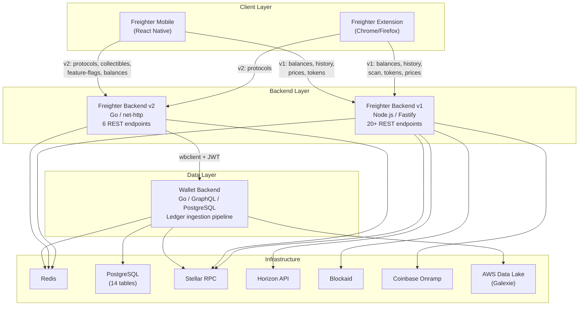
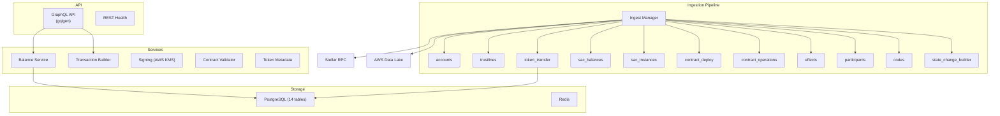

# Freighter System Architecture

> **Skill**: Load this when working on any Freighter feature, PRD, or integration to understand how the 6 codebases connect, what each owns, and where new features hook in.
>
> **When to use**: Planning features, writing PRDs, scoping work, understanding data flow, identifying affected systems.

---

## System Overview

Freighter is a Stellar blockchain wallet comprising 6 codebases across 3 tiers:

| Tier | System | Tech | Role |
|------|--------|------|------|
| **Client** | freighter-ext | TypeScript, React, Chrome Extension (MV3) | Browser wallet extension |
| **Client** | freighter-mobile | TypeScript, React Native, Expo | iOS/Android wallet app |
| **Backend** | freighter-backend (v1) | TypeScript, Node.js, Fastify | API gateway — balances, history, scanning, prices, tx submission |
| **Backend** | freighter-backend-v2 | Go, net/http | API gateway v2 — protocols, collectibles, feature flags, WB-proxied balances |
| **Data** | wallet-backend | Go, GraphQL (gqlgen), PostgreSQL | Ledger ingestion, account balances, token tracking, transaction/operation indexing |
| **Data** | wallet-backend v2 | Same repo, enhanced | Planned enhancements: SEP-50, history retention, TimescaleDB |

## System Topology



## Per-System Architecture

### Wallet Backend (stellar/wallet-backend)

The core data engine. Ingests Stellar ledger data and serves it via GraphQL.



**Key paths:**
- `internal/db/migrations/` — 18 SQL migration files
- `internal/serve/graphql/schema/` — 12 GraphQL schema files
- `internal/indexer/processors/` — 11 ingestion processors
- `internal/data/` — Data access layer
- `internal/entities/` — Domain models
- `pkg/wbclient/` — Go SDK consumed by freighter-backend-v2

### Freighter Backend v1 (Node.js/Fastify)

Legacy API gateway. All routes under `/api/v1/`. Being gradually replaced by v2.

```
freighter-backend/src/
├── route/index.ts          # All 20+ route definitions
├── service/
│   ├── mercury/            # Horizon/RPC indexer client
│   ├── prices/             # Token price worker + cache
│   ├── blockaid/           # Security scanning
│   ├── oracle/             # Band Protocol price oracle
│   ├── integrity-checker/  # v1↔v2 integrity validation
│   └── prometheus-query/   # Metrics
├── helper/
│   ├── soroban-rpc/        # RPC helpers
│   ├── horizon-rpc.ts      # Horizon helpers
│   ├── stellar.ts          # SDK helpers
│   └── onramp.ts           # Coinbase integration
└── config.ts               # Configuration
```

### Freighter Backend v2 (Go)

Modern API gateway. Stateless, proxies to wallet-backend for data.

```
freighter-backend-v2/internal/
├── api/
│   ├── serve.go            # Server init, 6 route registrations
│   ├── handlers/           # account_balances, protocols, collectibles,
│   │                         feature_flags, ledger_key_accounts, health
│   ├── middleware/          # recover, logging, headers, body_size_limit
│   ├── httperror/          # Error handling
│   └── httpresponse/       # Response formatting
├── services/
│   ├── wallet_backend.go   # wbclient integration (JWT auth)
│   └── rpc.go              # Stellar RPC (pubnet/testnet/futurenet)
├── store/redis.go          # Redis client
├── config/config.go        # 8 config structs
└── types/
    ├── interfaces.go       # Service, RPCService, WalletBackendService
    └── entities.go         # AccountInfo, Signer, LedgerEntryMap
```

### Freighter Extension (Chrome/Firefox)

Monorepo with `@shared` package and `extension` package.

```
freighter-ext/freighter/
├── @shared/                # Shared code
│   └── api/
│       ├── internal.ts     # Background script message bridge
│       └── types/types.ts  # Core types (Account, Balance, Token, DiscoverData)
├── @stellar/freighter-api/ # Public JS API for dApp integration
└── extension/
    └── src/
        ├── background/     # Service worker (auth, session, key management)
        │   ├── ducks/      # Background state
        │   └── messageListener/handlers/
        ├── contentScript/  # dApp ↔ extension bridge
        ├── popup/
        │   ├── views/      # 25+ views (Account, History, Discover, Send, Swap, etc.)
        │   ├── ducks/      # Redux slices (accountServices, cache, transactionSubmission, settings, views)
        │   ├── components/ # Reusable UI (AssetTile, accountHistory, manageAssets, swap, etc.)
        │   └── helpers/    # Hooks, utilities
        └── types/          # Extension-specific types
```

**State management**: Redux Toolkit (createAsyncThunk, createSlice)
**Routing**: React Router (popup views)
**Styling**: SCSS modules
**API calls**: `@shared/api/internal` → background message bridge → Fastify/Go backends

### Freighter Mobile (React Native)

React Native app with Zustand state management.

```
freighter-mobile/freighter-mobile/src/
├── components/
│   ├── screens/            # 15+ screens
│   │   ├── HomeScreen/
│   │   ├── HistoryScreen/
│   │   ├── DiscoveryScreen/  # WebView-based browser with tabs
│   │   ├── SwapScreen/
│   │   ├── SendScreen/
│   │   ├── SettingsScreen/
│   │   └── ...
│   ├── sds/                # Stellar Design System components
│   ├── primitives/         # Base UI components
│   └── layout/             # Layout wrappers
├── ducks/                  # Zustand stores (23 stores)
│   ├── balances.ts, history.ts, protocols.ts, browserTabs.ts,
│   ├── collectibles.ts, prices.ts, swap.ts, auth.ts,
│   ├── remoteConfig.ts, preferences.ts, walletKit.ts, ...
├── services/
│   ├── backend.ts          # API client (freighterBackendV1, freighterBackendV2)
│   ├── stellar.ts          # Stellar SDK helpers
│   ├── blockaid/           # Security scanning
│   └── storage/            # AsyncStorage + SecureStorage
├── navigators/             # React Navigation (tab + stack)
├── hooks/                  # Custom hooks
├── providers/              # Context providers
└── config/                 # Constants, routes, env config
```

**State management**: Zustand (23 stores)
**Navigation**: React Navigation (bottom tabs: Home, History, Discovery, Settings)
**API calls**: `services/backend.ts` → Axios → Fastify/Go backends
**Discovery**: Full WebView browser with tab management, not just a list

## Extension Points

Where new features hook into the existing architecture:

| Extension Point | Location | What Plugs In |
|----------------|----------|---------------|
| New ingestion processor | `wallet-backend/internal/indexer/processors/` | SEP-50 tokens, new event types |
| New GraphQL types/queries | `wallet-backend/internal/serve/graphql/schema/` | New balance types, queries |
| New DB tables | `wallet-backend/internal/db/migrations/` | New data models |
| New v2 API endpoint | `freighter-backend-v2/internal/api/handlers/` | dApp CRUD, rankings, admin |
| New feature flag | `freighter-backend-v2/internal/api/handlers/feature_flags.go` | Any feature toggle |
| New extension view | `freighter-ext/.../popup/views/` | New pages (dApp details, etc.) |
| New extension Redux slice | `freighter-ext/.../popup/ducks/` | New state domains |
| New mobile screen | `freighter-mobile/.../components/screens/` | New screens |
| New mobile Zustand store | `freighter-mobile/.../ducks/` | New state domains |
| New mobile API call | `freighter-mobile/.../services/backend.ts` | New backend integrations |

## v1 → v2 Migration Status

| Capability | v1 (Node.js) | v2 (Go) | Migration Status |
|-----------|-------------|---------|-----------------|
| Account balances | `GET /account-balances/:pubKey` | `POST /api/v1/account-balances` (via WB) | In progress |
| Account history | `GET /account-history/:pubKey` | Not yet | Planned |
| Token prices | `POST /token-prices` | Not yet | Planned |
| Token details | `GET /token-details/:contractId` | Not yet | Planned |
| Tx submission | `POST /submit-tx` | Not yet | Planned |
| Tx simulation | `POST /simulate-tx` | Not yet | Planned |
| dApp scanning | `GET /scan-dapp` | Not yet | Planned |
| Tx scanning | `POST /scan-tx` | Not yet | Planned |
| Asset scanning | `GET /scan-asset` | Not yet | Planned |
| Protocols/Discover | Not in v1 | `GET /api/v1/protocols` | v2 only |
| Collectibles | Not in v1 | `POST /api/v1/collectibles` | v2 only |
| Feature flags | `GET /feature-flags` (simple) | `GET /api/v1/feature-flags` (platform-aware) | Both active |
